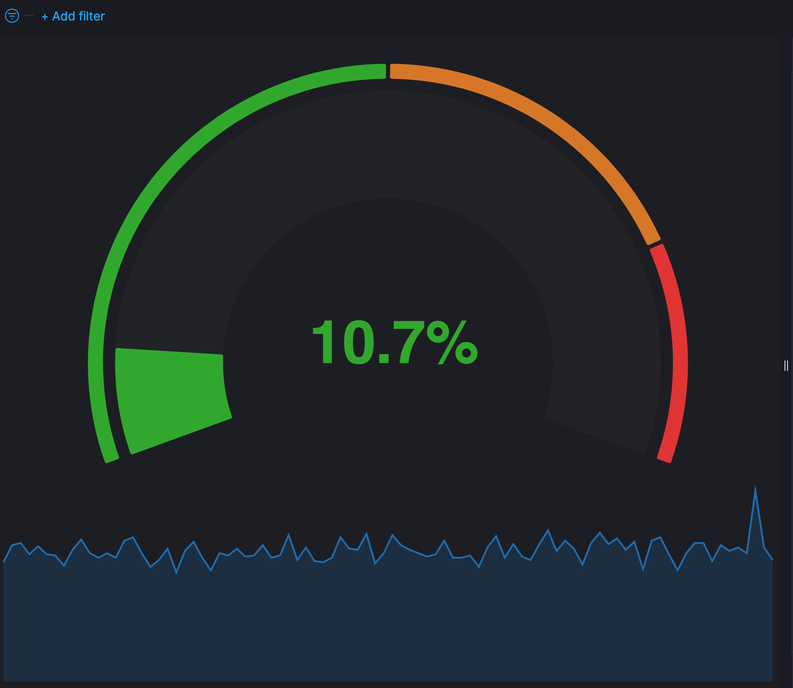
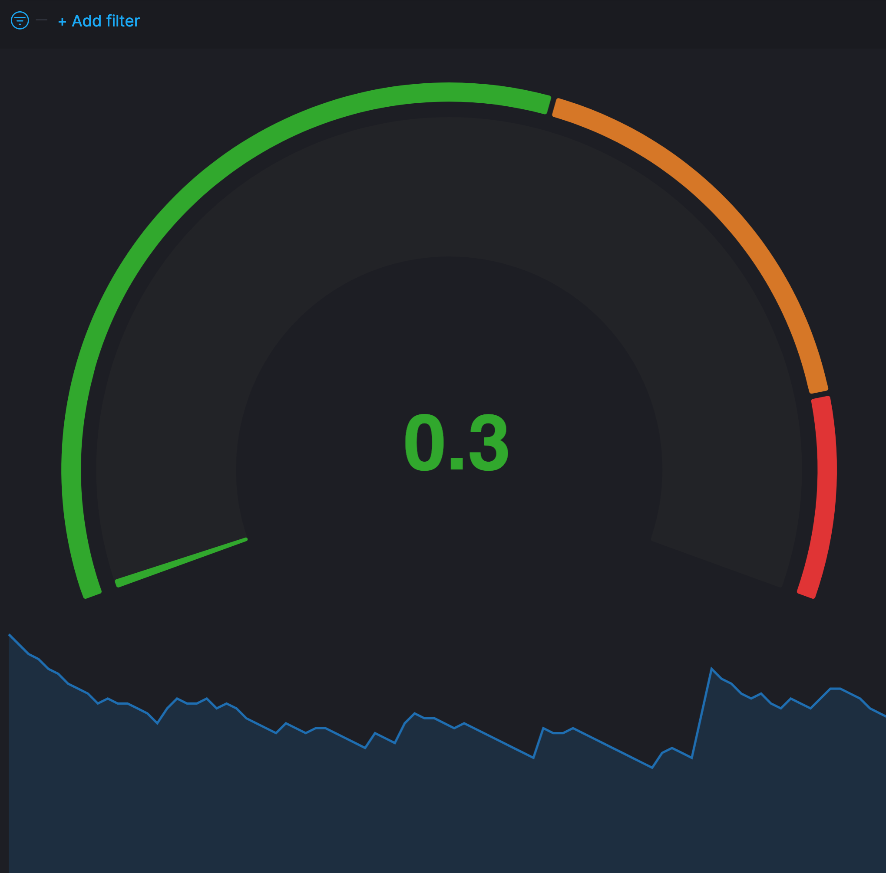

These are Compound Gauges in Vega

Compound Percent Gaug, good for percent values like Percent CPU
[vega_compound_percent_gauge.json](./vega_compound_percent_gauge.json)
 

Compound Value Gauge, good for values like Load Average
[vega_compound_value_gauge.json](./vega_compound_value_gauge.json)

